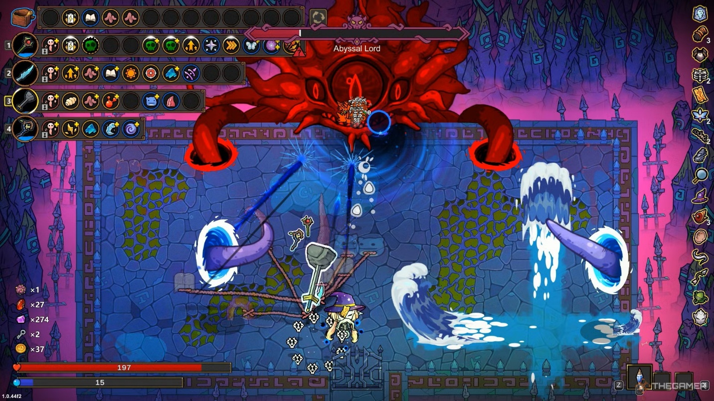

# Game Design Document (GDD) 

# Contents {#contents .TOC-Heading}

[Game Design Document (GDD)
[1](#game-design-document-gdd)](#game-design-document-gdd)

[1. Game Overview [2](#game-overview)](#game-overview)

[2. Story & Setting [3](#section)](#section)

- [Playable Characters [3](#_Toc199320024)](#_Toc199320024)

[3. Game Mechanics [4](#game-mechanics)](#game-mechanics)

[Controls [4](#_Toc199320026)](#_Toc199320026)

- [• Weapon Types [4](#_Toc199320027)](#_Toc199320027)

- [• Random Skills [4](#_Toc199320028)](#_Toc199320028)

- [• Random Events [5](#_Toc199320029)](#_Toc199320029)

[4. Art & Audio Style [6](#art-audio-style)](#art-audio-style)

- [Visual Style [6](#_Toc199320031)](#_Toc199320031)

- [Sound Design [6](#_Toc199320032)](#_Toc199320032)

[5. Level Design [7](#level-design)](#level-design)

- [Game Modes [7](#_Toc199320034)](#_Toc199320034)

[6. Technical Specifications
[7](#technical-specifications)](#technical-specifications)

[7. Development Timeline
[7](#development-timeline)](#development-timeline)

[Conclusion [8](#conclusion)](#conclusion)

[Reference Link: [8](#reference-link)](#reference-link)

**Title: \"The Unknown Future\"**

**Developer: Xiaowei Xue 300579496\
Genre: Roguelike Action RPG / Dungeon Crawler\
Platform: PC (Windows, macOS)\
Target Audience: Fans of fast-paced roguelikes (Ages 14+)\
Engine: Unity 6\
Programming Language: C#**

## 1. Game Overview

**Concept:\
A roguelike action RPG inspired by Magicraft where players control a
single hero in real-time combat, battling through procedurally generated
dungeons filled with deadly enemies, traps, and loot. Each run
offers randomized skills, weapons, and upgrades, encouraging adaptive
playstyles.**

**Core Gameplay Mechanics:**

-   **Fast-paced real-time combat (combos, skill usage)**

-   **Multiple hero classes (Warrior, Mage, Rogue, etc.) with unique
    playstyles**

-   **Procedural generation (random dungeons, enemy spawns, loot)**

-   **Permadeath (with meta-progression unlocks)**

-   **Randomized skill & weapon drops (no two runs are the same)**

**Unique Selling Points:**

-   **\"Build-as-you-go\" gameplay -- Adapt to random skill/weapon
    drops**

-   **Smooth, responsive combat (dodge rolls, parries, skill combos)**

-   **High replicability (daily challenges, seeded runs)**

-   **No grinding -- Pure skill-based progression**

## 

## 2. Story & Setting

**Setting:\
A cursed kingdom where a demonic throne corrupts all who seek it. The
player is one of many adventurers attempting to claim it---or destroy
it.**

**Plot Summary:\
Each run is a new attempt to reach the throne, with lore revealed
through item descriptions and rare NPC encounters.**

[]{#_Toc199320024 .anchor}Playable Characters **(Examples):**

-   **The Sell sword (Warrior): Balanced melee fighter.**

-   **The Pyromancer (Mage): Ranged AoE spells.**

## 3. Game Mechanics

[]{#_Toc199320026 .anchor}Controls**:**

-   **Movement: WASD**

-   **Attack: Mouse Click / Controller Trigger**

-   **Dodge Roll: Spacebar / Controller Button**

-   **Skills: 1-4 Keys / Controller Bumpers**

**Combat System:**

-   []{#_Toc199320027 .anchor}Weapon Types**:**

    -   **Swords (balanced)**

    -   **Daggers (fast, low damage)**

    -   **Staves (ranged magic)**

    -   **Greatswords (slow, high damage)**

-   []{#_Toc199320028 .anchor}Random Skills**:**

    -   **Found as loot (e.g., \"Fireball,\" \"Shadow Step\")**

    -   **Can be swapped mid-run**

**Progression & Meta-Upgrades:**

-   **Permanent Unlocks: New starting weapons, passive buffs**

-   **No XP Grinding: Skill matters more than stats**

**Randomization:**

-   **Procedural Dungeons: Rooms, traps, enemy spawns**

-   []{#_Toc199320029 .anchor}Random Events**:**

    -   **Cursed shrines (high risk, high reward)**

    -   **Merchant encounters (buy/sell gear)**

    -   **Elite enemy ambushes**

## 4. Art & Audio Style

[]{#_Toc199320031 .anchor}Visual Style**:**

-   **Pixel-art with modern lighting **

-   **Fluid animations (attack combos)**

[]{#_Toc199320032 .anchor}Sound Design**:**

-   **Crunchy SFX (sword slashes, spell explosions)**

## 5. Level Design

[]{#_Toc199320034 .anchor}Game Modes**:**

1.  **Standard Run: 5 biomes, final boss**

2.  **Endless Mode: Infinite scaling difficulty**

**Example Biome:**

-   **\"The Blood Crypts\" -- Tight corridors, vampire enemies, blood
    magic loot**

## 6. Technical Specifications

**Engine: Unity 6\
Save System: Run-based (permadeath) + meta-progression\
AI: Behavior trees (enemies adapt to player actions)**

## 7. Development Timeline

1.  **Pre-Production (3 weeks):  Combat prototype, art tests**

2.  **Production (3 weeks): Core gameplay, 3 biomes**

3.  **Polish (3 weeks): Balancing, juice (screen shake, hit pauses)**

4.  **Release: summer 2025**

## Conclusion

***The Unknown Future* is a fast, skill-based roguelike where every run
feels fresh, rewarding quick reflexes and smart build choices.**

## Reference Link:

<https://rogueliker.com/magicraft-review/>

<https://store.steampowered.com/app/2103140/_Magicraft/>

